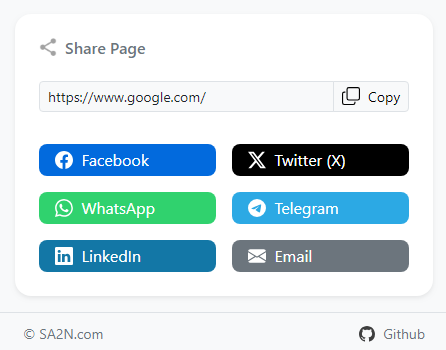

# Share-Extension

## Description
A Chrome extension to share web pages on social media platforms and via email.

  

## Installation
1. Clone the repository or download the project files.
2. Open Chrome and navigate to `chrome://extensions/`.
3. Enable "Developer mode" in the top right corner.
4. Click "Load unpacked" and select the project directory.

## Usage
Click the extension icon to open the popup. Use the buttons to share the current page on Facebook, Twitter, WhatsApp, Telegram, LinkedIn, or via Email.

## Credits
- SA2N: [sa2n.com](https://sa2n.com)

## Repository
- GitHub: [GitHub Repository Link](https://github.com/sa2ncom/Share-Extension)
